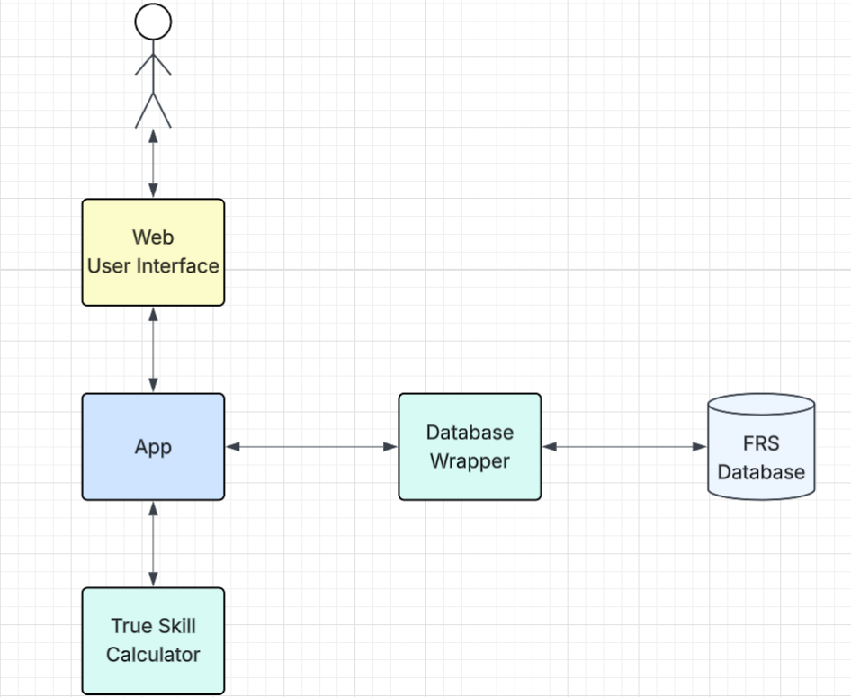

# Foosball-Ranking-System
Tracking the personal score of every player at foosball (table soccer).

The score is computed using the TrueSkill library, developed by Microsoft Research.
[TrueSkill documentation](https://trueskill.org/)

The app has the following architecture:

The app is accessed via a Web application that let's you add new players, add a new game and see every person score as well as the leader board.

The database is based on MongoDB and is hosted on Atlas, that offers a free hosting service.

